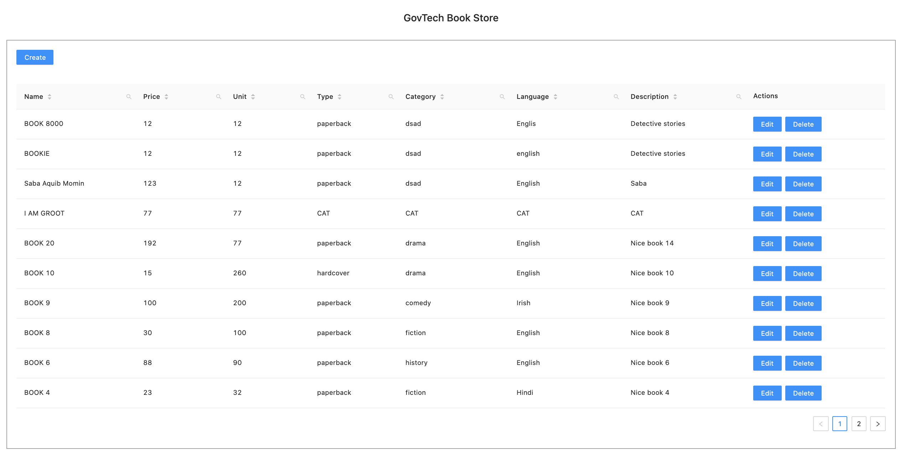
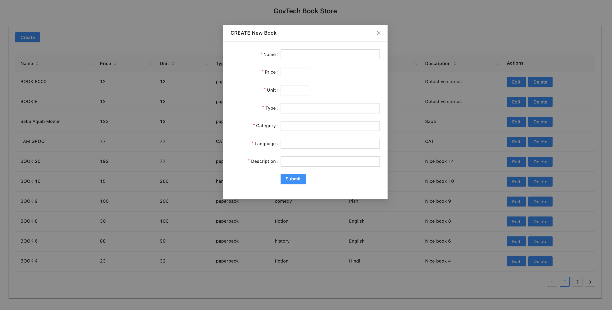
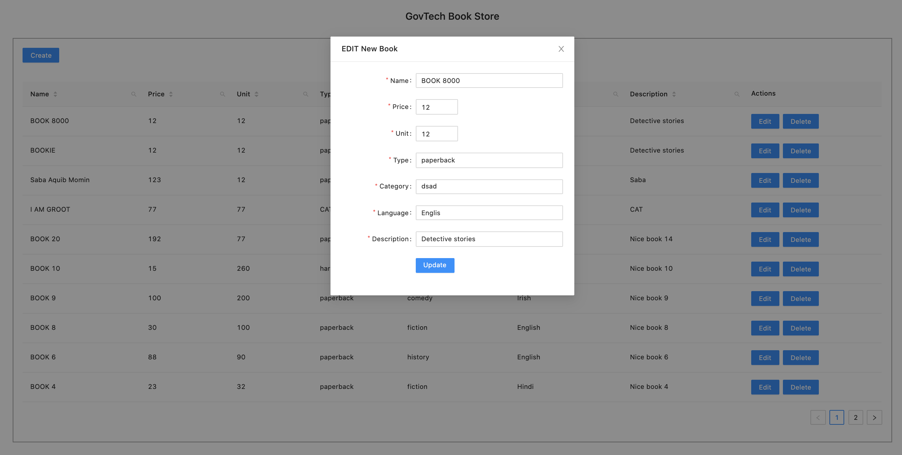
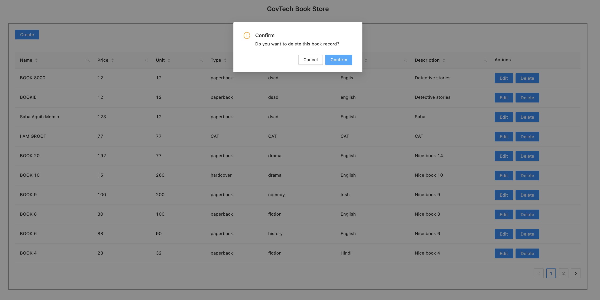
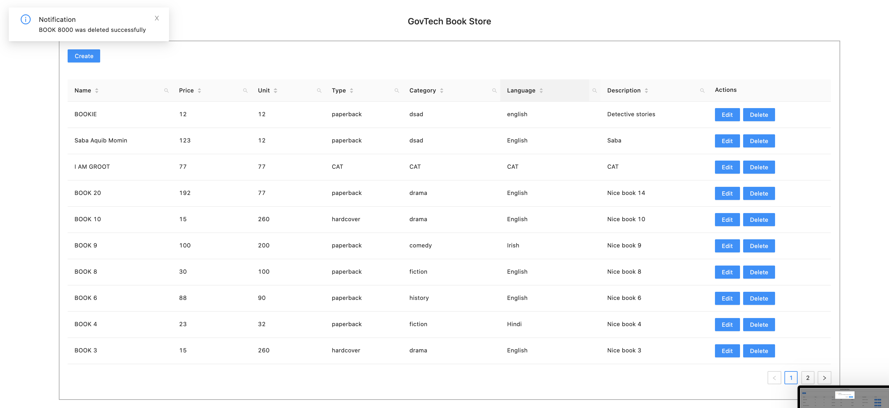
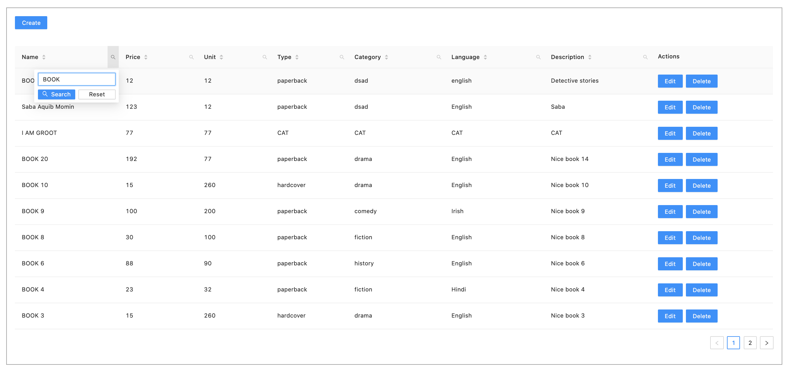
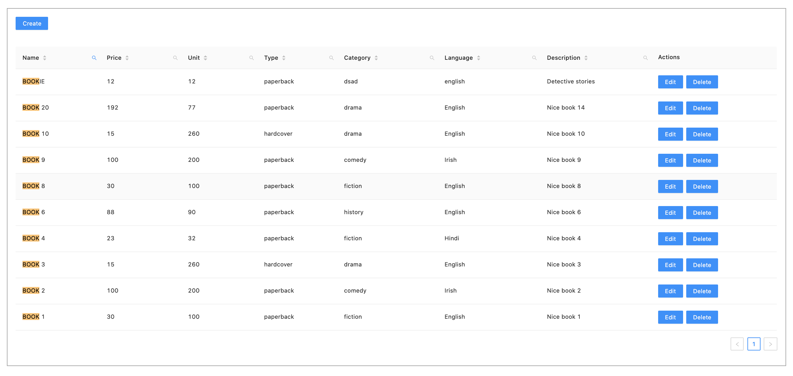

# Book Store Admin Dashboard
create-react-app cli is used to create this Book Store Admin Dashboard.
## Git Repository to Boilerplate
```bash
https://github.com/facebook/create-react-app
```

# Additional Setup
* Typescript support added
* SCSS is used for styling
* React Icons are used
* node version >= 12.0.0
* ant-design styled components
* axios client used for HTTP requests
* firebase for CRUD
  ```
   URL used for firebase:  https://bookstore-react-app.firebaseio.com
  ```

```bash
https://github.com/aquibmomin007/admin_dashboard
```

## 1. Setup
- install all dependencies
```bash
npm install
or 
yarn install
```
- to start the project locally
```bash
npm run start
or 
yarn start
```
- to create an optimized build
```bash
npm run build
or 
yarn build
```
- to run lint
```bash
npm run lint
or 
yarn lint
```

## 2. Stories
- **Admin Dashboard Listing page**<br/> 
  <br/>

- **Create New Book Modal**<br />
  <br/>
  
- **Edit Book Modal**<br />
  <br/>
  
- **Delete Book Modal**<br />
  <br/>

- **Notification Snackbar**<br />
  <br/>
  
- **Filter Search TextBox**<br />
  <br/>
  
- **Filter Result Highlted**<br />
  <br/>
